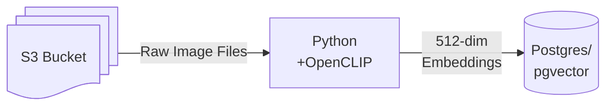

GPU time is still really expensive. When inferring with computer vision models—especially faster models like YOLO—the GPU often spends valuable time idle or waiting for image preprocessing tasks like resizing, cropping, and loading from storage. Optimizing these pre-inference steps can significantly improve throughput.

In this post, we'll explore and benchmark several strategies to accelerate an example app, including batching, [pillow-simd](https://github.com/uploadcare/pillow-simd), [fast_image_resize](https://github.com/Cykooz/fast_image_resize), and [DALI](https://github.com/NVIDIA/DALI). We'll identify bottlenecks and measure performance improvements provided by each method.

## Example App

To explore these optimization, we'll create a semantic search app over a collection of images in a cloud storage bucket. Images are loaded from S3, transformed to the appropriate size and format for the model, embedded using OpenCLIP, then stored in Postgres using pgvector for similarity search.

## The Base Case

Data to be inferred on rarely lives alongside the GPU. In this case, relatively high-latency cloud storage is involved, and we must pay the overhead of transferring data from the storage layer to the GPU. First we will benchmark the naive base case, downloading each image individually, resizing it, embedding it, and storing the resulting embedding in Postgres.

## Speeding Up Data Loading with Batch Downloads

TODO
